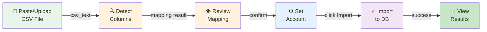
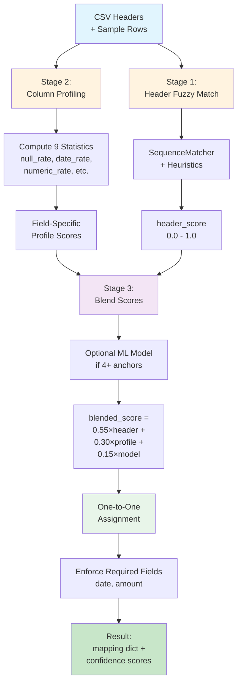
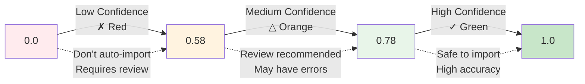
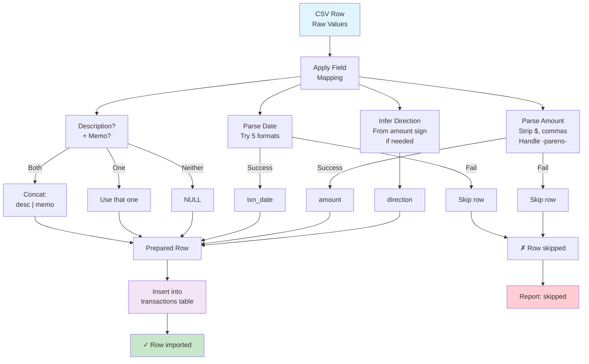

# CSV Transaction Import

## Overview

The CSV transaction import feature intelligently detects and maps columns from bank or brokerage CSV exports to transaction fields. Instead of requiring manual column selection, it uses **fuzzy header matching**, **column profiling**, and optional **machine learning** to automatically identify which columns contain date, amount, direction, category, payee, description, and other transaction metadata.

### Key Features

- **Smart column detection** — Recognizes variants like "Transaction Date", "Txn Dt", "Posted On", etc.
- **Confidence scoring** — Shows confidence levels (high/medium/low) for each detected mapping
- **Required field validation** — Ensures date and amount are always present
- **Post-date fallback** — Automatically uses "posted date" if "transaction date" is ambiguous
- **Description + memo concatenation** — Combines description and memo fields with " | " separator
- **Ignored columns visibility** — Shows which CSV columns won't be imported
- **Three-step workflow** — Paste → Detect → Review → Import

---

## User Guide

### Workflow Diagram



---

### Step 1: Paste or Upload CSV

1. Go to **Data** tab → **Import Transactions CSV** section
2. Click **📁 Choose file** to upload a CSV, or paste data directly into the textarea
3. The CSV preview shows up to 7 rows with column headers

### Step 2: Detect Columns

1. Click **🔍 Detect Columns** button
2. System analyzes the CSV structure and column contents
3. A **Column Mapping** section appears with detection results

### Step 3: Review Mapping

The mapping section displays:

- **Status badge** (top-right):
  - ✓ **High Confidence** (green) — Safe to import directly
  - ⚠ **Review Recommended** (orange) — Check mappings before import
  
- **Mapped fields** (grid layout):
  - ★ **Required** — Must be present (date, amount)
  - ◇ **Optional** — Nice-to-have fields
  - Each shows: **Field name** → **Detected column** with **✓/△/✗** confidence indicator
  
- **Ignored Columns** section:
  - Lists CSV columns that weren't mapped
  - You can re-upload with different columns or add data manually after import

### Step 4: Set Account (Optional)

Select an account from the dropdown if all rows should go to one account. Leave as "— auto / CSV column —" if:
- Your CSV includes an `account_id` column, or
- Rows should be assigned to different accounts manually later

### Step 5: Import

Click **✓ Import** button. System will:

1. Parse CSV with detected delimiter (comma, tab, semicolon, pipe)
2. Apply detected column mapping
3. Parse dates in supported formats
4. Infer direction from amount sign if needed
5. Concatenate description + memo if both present
6. Insert rows into database

Results show: "**✓ 142 imported · 3 skipped**"

---

## Technical Details

### Algorithm Overview



---

### Algorithm

The detection process runs in three stages:

#### Stage 1: Header Fuzzy Matching

```
_header_score(field, header) → float [0.0, 1.0]
```

- Compare field name (e.g., "date") with CSV header using `difflib.SequenceMatcher`
- Apply field-specific heuristics:
  - **date**: +0.20 boost for "transaction"/"txn", −0.15 penalty for "post"/"posted"
  - **amount**: +0.10 for "amt"/"value"/"price"
  - **direction**: +0.10 for "type"/"direction"/"dr"/"credit"
  - **payee**: +0.10 for "merchant"/"vendor"/"counterparty"

#### Stage 2: Column Profiling

```
_profile_column(values) → ColumnProfile(9 stats)
```

Analyze up to 120 sample rows, compute:
- `null_rate` — % empty cells
- `date_rate` — % parseable as date
- `numeric_rate` — % parseable as number
- `bool_rate` — % is "0"/"1"/"true"/"false"/"yes"/"no"
- `neg_rate` — % of numbers that are negative
- `median_abs` — median absolute value (hints at $ amounts)
- `mean_len` — average string length (description typically longer)
- `unique_ratio` — % unique values (payee more unique than direction)
- `direction_token_rate` — % matches direction keywords

Each field gets a weighted profile score:
- **date**: `0.85 × date_rate + 0.1 × (1 − null_rate) + 0.05 × (1 − numeric_rate)`
- **amount**: `0.65 × numeric_rate + 0.2 × (1 − null_rate) + 0.15 × median_hint`
- **direction**: `0.55 × direction_token_rate + 0.25 × (1 − numeric_rate) + 0.2 × (1 − unique_ratio)`
- **payee**: `0.5 × (1 − numeric_rate) + 0.3 × unique_ratio + 0.2 × (1 − null_rate)`
- (etc. for other fields)

#### Stage 3: Blended Confidence (with optional ML)

```
blended_score = 0.55 × header_score + 0.3 × profile_score + 0.15 × model_probability
```

- **Header score** (0.55 weight): Fuzzy match against field name
- **Profile score** (0.30 weight): Column statistics match
- **Model probability** (0.15 weight): Optional sklearn LogisticRegression (only if ≥4 high-confidence anchors)

The model is **optional** — sklearn import is guarded. If sklearn unavailable or insufficient training anchors, model_probability defaults to 0.0 for all fields.

### Confidence Thresholds

```python
HIGH_CONFIDENCE = 0.78  # Green ✓
MEDIUM_CONFIDENCE = 0.58  # Orange △
```

Score ranges and corresponding UI indicators:



- **Scores ≥ 0.78** → "✓ High confidence" (green badge)
- **Scores 0.58–0.77** → "△ Medium confidence" (orange badge)
- **Scores < 0.58** → "✗ Low confidence" (red badge)

### Import Guardrail

The transaction importer now blocks writes when either required field (`date` or `amount`) is below the medium threshold (`0.58`).

- Import result returns `inserted: 0` and a `warning` string explaining which required field confidence is too low.
- The Data page renders this warning so users can re-run detection and review the mapping before importing.

### One-to-One Assignment

1. Compute blended scores for all (header, field) pairs
2. Sort by score descending
3. Greedily assign highest-scoring pairs (each header and field used at most once)
4. Skip assignments below `MEDIUM_CONFIDENCE` threshold
5. Force-assign required fields (date, amount) even if score is low

### Post-Date Fallback

If a "date" field is detected and a post/posted header exists:
- Store as `_date_fallback` key in mapping
- At import time, try transaction date first; if missing/invalid, fall back to post date

### Data Processing

At import time (`import_transaction_csv`):



1. **Date parsing**: Try formats in order: `%Y-%m-%d`, `%m/%d/%Y`, `%m/%d/%y`, `%m-%d-%Y`, `%Y/%m/%d`
2. **Amount parsing**: Strip `$`, `,`; handle parentheses as negative
3. **Direction inference**: If direction column missing, infer from amount sign
4. **Description concat**: If both description and memo present, join as `f"{desc} | {memo}"`
5. **Field mapping**: Apply detected mapping to extract values

---

## Examples

### Example 1: Standard Bank CSV

```
date,amount,direction,description,payee
2026-01-15,1000,income,Payroll Deposit,Employer Inc
2026-01-16,-50.00,debit,ATM Withdrawal,ATM
2026-01-17,-125.43,,Grocery Store,Whole Foods
```

**Detection:**
- date → date (100% match)
- amount → amount (98% match)
- direction → direction (100% match)
- payee → payee (100% match)
- description → description (100% match)

**Result:** ✓ High Confidence (all required fields clear)

---

### Example 2: Brokerage Export with Variant Headers

```
Txn Date,Posted On,Narration,Category,Type,Value,Memo Text
2026-05-01,2026-05-02,Coffee,food,debit,-12.50,AM run
2026-05-05,2026-05-06,Gas,transport,expense,-45.00,Fill-up
```

**Detection:**
- Txn Date → date (fuzzy + "txn" boost: 88% → 0.88)
- Posted On → date (fuzzy but "post" penalty: 65% → 0.50, loses to Txn Date)
- Value → amount (fuzzy + "value" boost: 78% → 0.88)
- Type → direction (fuzzy + "type" boost: 62% → 0.72)
- Narration → description (fuzzy: 62%)
- Category → category (fuzzy: 78%)
- Memo Text → memo (fuzzy: 65%)

**Mapping:**
```
date → Txn Date (88% confidence)
_date_fallback → Posted On
amount → Value (88% confidence)
direction → Type (72% confidence)
description → Narration (62% confidence → medium confidence)
category → Category (78% confidence)
memo → Memo Text (65% confidence)
```

**Result:** ⚠ Review Recommended (Narration to description is medium confidence; Memo is medium; direction is medium)

---

### Example 3: CSV with Extra Columns

```
transaction_id,date,posted_date,description,category,amount,type,internal_ref,bank_code
1001,2026-01-15,2026-01-15,Paycheck,income,5000,credit,REF123,BANK456
1002,2026-01-16,2026-01-16,Groceries,food,-85.50,debit,REF124,BANK456
```

**Mapped:**
- date → date
- amount → amount
- description → description
- category → category
- type → direction

**Ignored:**
- transaction_id (numeric but not amount-like)
- posted_date (header score lower than date)
- internal_ref (no field matches)
- bank_code (no field matches)

**UI shows:**
```
Ignored Columns (3)
[internal_ref] [bank_code]
These columns won't be imported. You can re-upload with 
different columns or add them manually after import.
```

---

## Supported Date Formats

Import automatically tries these formats (in order):

- `%Y-%m-%d` (2026-05-01)
- `%m/%d/%Y` (05/01/2026)
- `%m/%d/%y` (05/01/26)
- `%m-%d-%Y` (05-01-2026)
- `%Y/%m/%d` (2026/05/01)

**Tip:** Stick to unambiguous formats. "01-02-2026" is rejected to avoid confusion.

---

## Supported Delimiters

Auto-detected via `csv.Sniffer`:
- Comma (`,`) — primary
- Tab (`\t`)
- Semicolon (`;`)
- Pipe (`|`)

Falls back to comma if detection fails.

---

## Direction Mapping

If "direction" column is present, must contain values like:
- **Expense/debit**: debit, dr, withdrawal, charge, expense
- **Income/credit**: credit, cr, deposit, income, transfer

If direction column is missing, inferred from amount sign:
- Negative → expense
- Positive → income

---

## Troubleshooting

### "Could not detect columns" error

**Causes:**
- CSV has no header row (first line is data, not column names)
- CSV is missing required columns: date and amount
- Delimiter not detected correctly

**Fix:**
- Ensure first line is a header row
- Check that CSV has a date-like column and numeric column
- Try copying fewer rows and simpler format

### "Review Recommended" status

**Likely causes:**
- Column names are very different from standard (e.g., "Trans" vs "transaction")
- Amount column has mixed content (text + numbers)
- Date format unrecognized

**Fix:**
- Review the detected mappings carefully
- Click elsewhere and re-detect if you want the AI to try harder
- Manually add clarity to column headers if possible

### Some rows skipped

**Causes:**
- Missing required field (date or amount) in a row
- Date format invalid for that row
- Amount unparseable (e.g., "N/A")

**Fix:**
- Check skipped rows in the CSV
- Standardize date/amount formats
- Delete or fix invalid rows

### Description + Memo showing as "X | "

**Cause:**
- Description is present but memo is missing/empty

**Expected:** Both description and memo must be present to concatenate. If only one is present, that one is used.

---

## Implementation (`app/csv_mapper.py`)

**Main function:**
```python
detect_transaction_csv_mapping(csv_text: str) -> dict
```

Returns:
```python
{
    "ok": bool,
    "mapping": dict[str, str],  # field → header
    "confidence": dict[str, float],  # field → confidence [0, 1]
    "alternatives": dict[str, list],  # field → [top 3 alternatives]
    "needs_confirmation": bool,
    "delimiter": str,
    "headers": list[str],
    "preview": list[dict],
    "strategy": "fuzzy_match",
    "thresholds": {"high": 0.78, "medium": 0.58},
}
```

**Key helpers:**
- `_normalize_header()` — Lowercase, strip quotes/spaces, convert `-/_` to spaces
- `_profile_column()` — Compute 9-stat ColumnProfile
- `_header_score()` — Fuzzy match with field-specific heuristics
- `_profile_score()` — Field-specific profile weighting
- `_maybe_model_probs()` — Optional weakly-supervised LogisticRegression

**Integration:**
- API endpoint: `POST /api/transactions/detect-columns` (FastAPI)
- Writer function: `import_transaction_csv()` accepts `field_mapping` parameter
- Frontend: `templates/data.html` — Three-step workflow JS

---

## Future Improvements

- [ ] Store mapping presets for frequently-used CSV formats
- [ ] Allow manual column mapping override before import
- [ ] Batch import multiple CSVs with same format
- [ ] Smart categorization based on description
- [ ] Reconciliation workflow for duplicate detection
- [ ] Support for more date/number locales
